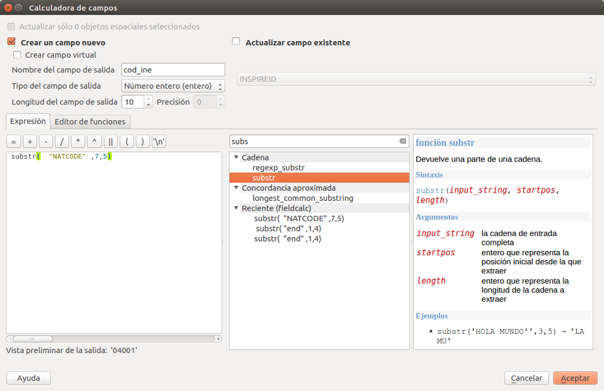
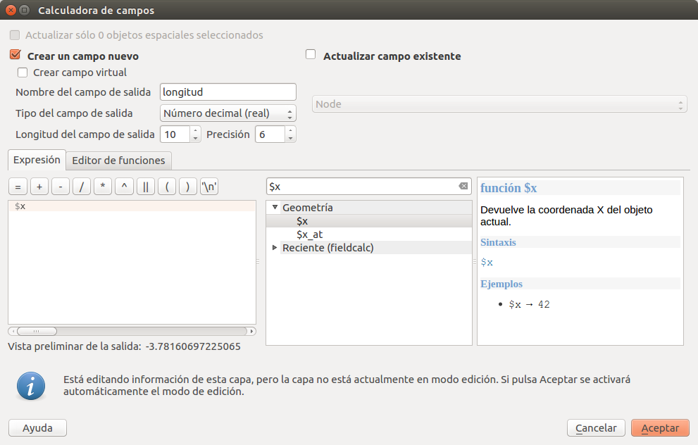

# Taller de Periodismo de Datos
Materiales para el Taller de Periodismo de Datos de El País en colaboración con la Fundación BBVA. Este módulo contempla la utilización de mapas como herramienta en el Periodismo. A lo largo de dos sesiones aprenderemos a utilizar dos de las herramientas más populares para realizar mapas: [CARTO](https://carto.com/) y [QGIS](http://www.qgis.com/).

La metodología del módulo consistirá en ir conociendo las posibilidades que nos ofrecen las herramientas GIS para realizar análisis, manipulación y creación de nuevos campos y variables que nos sirvan para representar información sobre un mapa. Iremos cambiando de una herramienta a otra con el objetivo de ir conociendo el potencial y las posibilidades que nos ofrece cada una. A lo largo de las dos sesiones vamos a tratar aspectos como:
* [**El Color**](#color): la utilización del color es fundamental a la hora de dar estilo a un mapa. La elección de una paleta de colores adecuada, así como de la escala correcta es fundamental a la hora de comunicar la información.
* [**Fuentes de información**](#sources): dónde podemos encontrar datos GIS para crear mapas: IGN, Natural Earth, OSM y Geofabrik entre otros.
* Ser capaces de crear **mapas de puntos**. Nos sirven para geolocalizar acontecimientos como estaciones de servicio, de bicicleta pública, un accidente o un acontecimiento de última hora.
* [**Manipulación de archivos shp**](#vector). Realizar procesos de manipulación de archivos vectoriales, operaciones con atributos, uniones entre shapefiles o asígnación de datos externos a un shapefile.
  - [Descarga de los shapefiles oficiales](#download-lineas-limite): Obtener los shapefiles oficiales de los diferentes niveles administrativos de España.
  - [Conversión a un tipo de sistema de coordenadas diferente](#from-etrs90-to-wgs84).
  - [Unir o mergear dos archivos shapefile en uno solo](#merge).
  - [Realizar cálculos con los campos de la tabla de atributos](#get-ine-code): extracción de información de un campo con la calculadora de campos para obtener el código del INE.
  - [Añadir un csv externo](#add-csv): asignar datos de un `csv` a polígonos como municipios, provincias, etc.
  - [Join entre capas](#join-csv): Realizar _joins_ o uniones entre un shapefile y un csv.
  - [Calcular la densidad de población](#density-qgis): Calcular la densidad de población por municipios con la calculadora de campos.
  - [Aplicar una escala de color en QGIS](#color-qgis).
  - [Extracción de información sobre geometería](#get-geometry-area): calcular el área de un polígono con la calculadora de campos.
  
  
* [**Crear un mapa con CARTO**](#carto)
  - [Subir datos a CARTO](#upload-carto). Aprenderemos a subir tanto archivos `csv` como `shp`.
  - [Mapa de la Tasa de Paro por provincias con CARTO](#make-carto).
  - [Realizar una unión entre dos tablas en CARTO](#join-carto).
  - [Mapa de puntos en CARTO](#points-carto).
  - [Añadir widgets en CARTO](#widget-carto).
  - [Realizar análisis con CARTO](#analysis-carto).
  
* [**Conversión**](#conversion) entre sistemas de coodenadas diferentes.

## <a name="color">Color</a>
- A la hora de escoger una escala de color existente, [Colorbrewer](http://colorbrewer2.org/) es una muy buena herramienta para acceder a una paleta de colores adecuada. Los colores que nos ofrece pertenecen al estudio científico de la Dr. Cynthia A. Brewer y nos permite seleccionar escalas de color secuenciales, qualitativas o divergentes. Nos permite exportar los colores como una paleta de colores para GIMP (Software libre para trabajo vectorial), clases CSS, un array JavaScript con los colores en formato rgb.

- Pero, ¿y si estas escalas no nos convencen o estamos cansados de verlas replicadas en todos los mapas? Podemos crear nuestra propia escala de color. A la hora de crear una escala existen multitud de factores a tener en cuenta, como son la interpolación de los colores, la manera en que aplicamos los propios colores en función de una determinada escala, o la corrección automática de la luminosidad. Ambas exceden los límites de este módulo pero a quien le interese puede echar un ojo a [este post](https://www.vis4.net/blog/2013/09/mastering-multi-hued-color-scales/) de Gregor Aisch o directamente a [esta herramienta](http://gka.github.io/palettes/#colors=lightyellow,orange,deeppink,darkred|steps=7|bez=1|coL=1) que él mismo desarrolló.
  - [Gregor Aisch](https://twitter.com/driven_by_data) es el responsable de [Chroma.js](https://github.com/gka/chroma.js), una librería JavaScript llamada que permite crear escalas de color corregidas y ajustadas.
  
- Para conocer más sobre escalas de color podeis visitar [este post](https://roadtolarissa.com/blog/2015/01/04/coloring-maps-with-d3/) de [Adam Pearce](https://twitter.com/adamrpearce) en el que explica las diferencias entre una escala de color lineal, quantitativa o quantil.

## <a name="sources">Fuentes de información</a>
En las siguientes páginas se pueden descargar shapefiles y archivos _raster_ de carácter político, natural o cultural:
- Centro de descargas del [CNIG](http://centrodedescargas.cnig.es/CentroDescargas/index.jsp). Tiene una interfaz un poco compleja al principio hasta que averiguamos cómo encontrar los datos que nos interesan. Es el centro de referencia a nivel nacional para descargar datos SIG. Tiene todos los vuelos con sus correspondientes ortofotos, datos ráster, modelos de elevación del terreno (incluso generados con lidar de 2x2m) o datos de tipo vectorial: información sobre carreteras, puertos, estaciones, etc.

-  Ministerio de Agricultura y Pesca, Alimentación y Medio Ambiente ([Magrama](http://www.mapama.gob.es/es/cartografia-y-sig/ide/descargas/default.aspx)). Datos sobre Agricultura, Biodiversidad, Calidad y evaluación ambiental, Agua y muchos más. Aquí podemos acceder de una manera sencilla a datos sobre parques naturales, cuencas hidrográficas o zonas con riesgo de inundación. Los datos suelen estar en formato shp o kmz/kml.

- [Natura Earth Data](http://www.naturalearthdata.com/). Natural Earth es un proyecto open source donde podemos encontrar mucha información tanto de tipo vectorial como ráster. A pesar de que es un proyecto serio y consolidado, siempre debemos intentar acudir a las fuentes de datos oficiales. Aunque en Natural Earth encontramos archivos shape con códigos o datos sobre población, por ejemplo, estos no se actualizan con la frecuencia que lo hacen los diferentes organismos competentes.

- [Diva-gis.org](http://www.diva-gis.org/gdata) nos ofrece datos GIS de cualquier país del mundo. Aunque son datos sin mucho nivel de detalle, nos pueden salvar cuando estamos realizando un mapa de algún país concreto y no encontramos datos sobre su contorno, ríos, carretas o límites administrativos.

## <a name="mapshaper">Mapshaper</a>
[Mapshaper](http://mapshaper.org/) es una herramienta open source desarrollada por [Mathew Bloch](https://github.com/mbloch). Además de una aplicación por [línea de comandos](https://github.com/mbloch/mapshaper/wiki/Introduction-to-the-Command-Line-Tool) que nos permite manipular archivos Shapefile, GeoJSON, TopoJSON, CSV entre otros formatos, también cuenta con una interfaz web. Podemos utilizar Mapshaper para reducir el peso de los archivos shapefile.   

Cuando estamos trabajando en un mapa que va ser publicado en la web, el peso de los archivos es muy importante. Además, servicios como CARTO tienen un límite de almacenamiento gratuito.
1. Para reducir el peso de un shapefile podemos arrastrar el conjunto de archivos comprimidos a la web.
  - . Si tienes los archivos sin comprimir, simplemente selecciona todos los archivos, `.dbf`, `.shp`, `.prj`, `.qpj`, `.shx` y comprimelos juntos.
2. Seleccionamos `import`.
3. Seleccionamos en el botón `Simplify`. Mapshaper nos ofrece varios algoritmos de simplificación (reduce el peso del archivo eliminando puntos). Podemos dejar las opciones por defecto → `Apply`.
4. A continuación aplicamos un porcentaje de Simplificación. Un 20% será suficiente como para reducir el peso del archivo aproximadamente 30Mb (en función del archivo).
5. Si ha encontrado errores (aparece un `warning` arriba a la derecha) podemos seleccionar la opción `repair`.
6. Por último, exportamos el archivo en formato `shp`.


## <a name="vector">Manipulación de archivos shp</a>
En este apartado vamos a aprender a realizar varias operaciones básicas con QGIS. Nuestro objetivo final será crear un mapa de la densidad de población por municipio en España.

#### <a name="download-lineas-limite">Descarga de Líneas Límite</a>

1. Descargamos los shapefiles oficiales del enlace del CNIG: **Centro de descargas del Instituto Geográfico Nacional** [Enlace ](http://centrodedescargas.cnig.es/CentroDescargas/equipamiento.do?method=mostrarEquipamiento). Aquí descargaremos los archivos oficiales en formato _shapefie_ (`shp`). Este archivo incluye más shapefiles de los que vamos a necesitar. Si hubiera algún problema con la descarga también se encuentra en la carpeta `shapefiles` del repositorio.    

2. Descomprimimos los archivos. Vamos a trabajar con dos archivos incluidos en dos carpetas diferentes:   
 * `recintos_municipales_inspire_peninbal_etrs89`  
 * `recintos_municipales_inspire_canarias_wgs84`   

 El sufijo de los archivos nos indica en qué Sistema de Coordenadas se encuentra cada conjunto de datos (`ETRS89` y `WGS84`).
 El resto de carpetas contienen las entidades Comunidades Autónomas y Provincias (recintos) además de los contornos (líneas).   
 
3. Añadimos los dos archivos al proyecto que hemos creado en QGIS mediante la opción **capa** → **añadir capa** → **Añadir capa vectorial**. Es importante seleccionar la **codificación** `UTF-8` para no perder información.

#### <a name="from-etrs90-to-wgs84">Convertir un Shapefile a otro sistema de coordenadas</a>
En nuestro panel de capas de la izquierda tenemos dos capas abiertas. Una capa representa todos los municipios españoles de la Península junto con Baleares, Ceuta y Melilla. La otra capa contiene los municipios de las Islas Canarias.  

En este apartado vamos a aprender como unir estos dos archivos en uno solo. Para poder hacer operaciones entre dos archivos `shp` los dos deben estar bajo el mismo sistema de coordenadas. Para ello vamos a convertir el archivo de Canarias a `ETRS89`.
1. Click derecho sobre el archivo de Canarias y seleccionamos **Guardar como...**
2. En `Formato` seleccionamos `Archivo shape de ESRI`.
3. Seleccionamos donde queremos guardar el archivo (asegurarnos de que tenemos permisos en la carpeta) y el nombre que queremos (por ejemplo `recintos_municipales_inspire_canarias_etrs89.shp`).
4. En el apartado `SRC`  seleccionamos como **Sistema de Coordenadas** `ETRS89` o `EPSG:4258`.
5. Nos aseguramos de que la pestaña `Añadir archivo guardado al mapa` se encuentra seleccionada. Al aceptar deberíamos tener una nueva capa añadida al proyecto, de lo contrario la añadimos manualmente. Podemos eliminar la capa de Canarias en WGS84.

#### <a name="merge">Unir o mergear dos archivos shapefile en uno solo</a>
A continuación, vamos a unir las dos capas en un sólo archivo shape. Es fundamental que el paso anterior se haya realizado correctamente ya que cualquier operación espacial entre dos o más capas requiere que estas se encuentren bajo el mismo sistema de coordenadas.   
1. Seleccionamos la pestaña `procesos` del menú superior. Seguidamente `Caja de Herramientas`. Y a continuación la herramienta `Merge Vector Layers` (podemos hacer una búsqueda con `merge`).
2. Seleccionamos las dos capas y nombramos el archivo, por ejemplo `recintos_municipales_spain_etrs89`. Podemos comprobar como las dos se encuentran en `EPSG:4528`. Si las dos capas no tienen el mismo sisema de coordenadas el proceso fallará.
  

3. Hacemos click sobre `Run` para realizar el `merge` entre los dos shapefiles. Deberíamos haber obtenido un nuevo archivo que incluye los polígonos de todos los municipios del país.

#### <a name="get-ine-code">Extracción de información de un campo con la calculadora de campos</a>
El siguiente paso que vamos a realizar es extraer el código del INE de los shapefiles de CNIG. Para acceder a la tabla de atributos de un shapefile tenemos que hacer click con el botón derecho sobre la capa o en el icono . Se nos abrirá la siguiente ventana:   

       

 Gracias a haber seleccionado la codificación `UTF-8` vemos como los nombres de los municipios presentan todos sus caracteres correctamente. Sobre esta tabla de atributos podemos realizar cálculos para filtrar en base a unas reglas, modificar o incluso crear nuevos campos.  

 En este caso nos interesa el campo `NATCODE`. El `NATCODE` es un código que identifica de manera única a cualquier polígono (en este caso a cualquier municipio). Podemos extraer el código del **INE** de este campo para poder cruzarlo con un csv que hayamos obtenido del INE. Nuestro objetivo es poder asociar unos valores específicos a cada municipio y para ello necesitamos un `id`.   

 Para éste propósito contamos con la `calculadora de campos` . Hacemos click sobre el icono. Vamos a extraer una cadena de texto de uno de los campos de la tabla de atributos y a crear una nueva columna con el resultado.
 
 1. Introducimos el nombre que vamos a dar a la nueva columna en la tabla de atributos, por ejemplo `cod_ine`. Si queremos que el resultado de esta operación sea una cadena de texto y por lo tanto que conserve los ceros por la izquierda (`04004` vs ~~`4004`~~) tenemos que seleccionar el tipo de campo de salida como `Texto` (cadena). De lo contrario dejamos el valor `Numero enterio (int)` por defecto. Dado que en este tutorial vamos a subir después los datos a CARTO, podemos crear una columna en la que el código del INE tenga ceros por la izquierda y otra en la que no.
 

 2. Todos los desplegables de la derecha nos permiten ir construyendo una consulta a la tabla de atributos, una _query_, cuyo resultado será el nuevo campo. Además, nos permiten consultar la documentación asociada a cada función en la caja de la derecha.   

 3. A continuación vamos a utilizar un método del desplegable `Cadena` (String) llamado `substring`. Vamos a extraer parte de ese código y generar un nuevo campo. Este método nos permitirá modificar el valor de una celda en base a tres argumentos:     

 	* `cadena_de_entrada` → nombre de la columna de la cual queremos obtener nuestro nuevo campo.   
 	* `startpos` → posición inicial desde la que comenzaremos a extraer caracteres (empezando por el primero).
 	* `longitud` → longitud de la cadena a extraer.  

  En este caso nuestra consulta será como muestra la imagen:

  

  En la parte inferior izquierda de la calculadora tenemos una vista preliminar del campo de salida. Si hemos elegido como campo un número entero, al salvar se perderán los ceros por la izquierda aunque en la previsualizacón sí aparezcan.

  Si en algún momento de este proceso nos equivocamos deberemos eliminar el campo y crear uno nuevo o actualizarlo en la opción superior derecha `actualizar campo existente` (tan sólo podremos actualizar el contenido, no la naturaleza del campo). Al finalizar deberemos salvar desde la tabla de atributos .
 4. Ya tenemos el codigo del INE para cada municipio.
 5. Ahora podemos continuar con el tutorial para ver cómo generar un nuevo campo con el área del municipio o subir este shapefile a CARTO y mergearlo con algunos datos que tengamos a nivel municipal.
  - Si vamos a subir este shapefile a CARTO es una buena oportunidad para utilizar [Mapshaper](#mapshaper) para reducir el peso del archivo.

#### <a name="add-csv">Añadir un csv externo para asignar sus datos a polígonos</a>
A continuación vamos a cargar los datos que queremos asociar a cada municipio. Vamos a utilizar los datos del [Revisión del padrón municipal a 1 de enero de 2017](http://www.ine.es/dynt3/inebase/index.htm?padre=525). Los datos vienen divididos por provincias pero el primero de ellos incluye los datos de todos los municipios. Este archivo requiere de una pequeña manipulación para extrar el código de municipio (`código de provincia + código de municipio`). Este cálculo podemos hacerlo en Excel, libre office o incluso en QGIS. Podéis procesar los datos y guardarlos como csv o bien utilizar el csv `poblacion_municipios.csv` de la carpeta `data` del repositorio.   

 QGIS tiene una opción muy completa para añadir capas de texto delimitado (`csv`, `tsv`, etc.). Pero si queremos que los campos sean tratados como texto (y no elimine los ceros por la izquierda) necesitamos incluir un archivo en el mismo directorio cuya extensión incluya una `t` (de `type`) al final. Por ejemplo, si el archivo se llama `data.csv`, tenemos que crear un archivo llamado `data.csvt`. Dentro de este archivo debemos especificar la naturaleza de los campos: si queremos que todas las columnas sean tratadas como texto (`String`) este archivo deberá tener el siguiente contenido (`"String"`,`"String"`,...) una por cada columna. Si queremos que sean números enteros:`int`, decimales: `real`, etc.
 
 Como esta opción es un poco complicada, aunque conviene conocerla, también podemos ahorrarnos este paso y añadir el csv como hemos hecho con los shapefiles, como si fuera una capa vectorial (añadir capa vectorial).
 

#### <a name="get-geometry-area">Extracción de información sobre geomtería del polígono con la calculadora de campos</a>
La calculadora de campos de QGIS nos ofrece funciones relacionadas con la geomtría y la geodesia que vamos a utilizar. Estas funciones las podemos encontrar en el apartado **Geomgetría** de la calculadora de campos. A continuación vamos a ver cómo podemos calcular el área de un polígono.
1. El proceso es parecido al que seguimos para crear un nuevo campo.
2. Seleccionamos el nombre de la nueva columna, su naturaleza.
3. Por último, seleccionamos la opción $area del apartado Geometría (podemos utilizar el buscador).

#### <a name="join-csv">Join entre capas en QGIS</a>
A continuación vamos a unir los datos del csv con los polígonos de los municipios. Hacemos click con el botón derecha sobre nuestro shapefile → propiedades → `Uniones` y en el icono . Seleccionamos la capa con la cual queremos hacer el `join` y los dos campos que cruzaremos. Podemos elegir qué campos queremos unir, en este caso sólo nos interesa el de población.   


 Si abrimos la tabla de atributos veremos como hemos añadido un nuevo campo. **PERO** es un campo _virtual_, sólo existe temporalmente y no en el shapefile original. Además no podemos hacer operaciones sobre él. Si creamos una copia de este shapefile se añadirá el nuevo campo como uno más. **botón derecho** → **guardar como** → etc.

#### <a name="density-qgis">Calcular la tasa de densidad con la calculadora de campos</a>
Volvemos a abrir la calculadora de campos. Seguimos los pasos aprendidos para generar un nuevo campo. Esta vez la densidad de población. Importante:   
 - Seleccionar como tipo de salida de campo `Número decimal (real)`
 - `longitud de campo de salida`: `20`
 - Precision mínima de `10`.

Introducimos la siguiente expresión:
```
to_real( "data_POB00"  /  $area  ) * 10000  
```
 
Dividimos la población entre el área del polígono. Lo multiplicamos por 10.000 para obtener habitantes por hectarea y _parseamos_ el dato a número real (decimal) para conservar los decimales con `to_real(...)`. Esta operación generará un nuevo campo con la densidad de población por municipio. A continuación
sólo deberemos aplicar una escala de color a nuestros datos.   

**NUNCA** debemos representar datos absolutos en un mapa. Siempre hemos de ponerlos en contexto con alguna otra variable.

#### <a name="color-qgis">Escalas de color en QGIS</a>
A continuación vamos aplicar una escala de color para poder apreciar la densidad de población de cada municipio. En **propiedades** de la capa → pestaña **estilo**  y en el desplegable seleccionamos → _graduado_. En el apartado columna seleccionamos nuestra variable `densidad`, elegimos la rampa o escala de color que queramos y en `Clasificar`. Si elegimos un buen número `Clases` podremos apreciar una mayor precisión en la distribución del color.  
La opción **Modo** nos permite utilizar diferentes tipos de escalas. En nuestro contexto la opción `Quantil (cuenta igual)` o `Rupturas naturales (Jenks)` nos permiten apreciar mejor la distribución de los valores.


#### <a name="print-composer">Utilizar el print composer de QGIS</a>
Una vez tenemos nuestro mapa queremos crear una imagen a buena resolución de nuestro mapa, listo para publicar. Pulsamos en el icono .
Podemos rellenar el campo nombre. A continuación en añadir mapa .    
Con el ratón pulsado arrastramos desde una esquina hacia la contraria dibujando la extensión del `canvas`. Apareceá exactamente lo mismo que estabamos viendo en la ventana principal de `QGIS`. Existe la posibilidad de eliminar el fondo y exportar la imagen con transparencia (muy útil si luego vamos a trabajar con ella en algún otro programa). En la pestaña `Diseño`del menú derecho	y en el apartado `Configuración de página` seleccionamos `Cambiar`: **borde** y **relleno** transparente.   
En la pestaña 	`Propiedades del elemento` deseleccionamos la pestaña `fondo`.   


Si queremos crear una composición que incluya las Islas Canarias cerca de la península tendríamos que crear dos mapas en nuestro `print composer`:
- Eliminamos o deseleccionamos el mapa.
- Sin cerrar esta ventana volvemos a la vista principal de QGIS. Hacemos zoom sobre la península.
- Volvemos al diseño de impresión y añadimos un nuevo mapa. En esta ocasión debería aparecer sólo la península.
- De nuevo en la ventana principal hacemos zoom sobre las Canarias. En el diseño de impresión añadimos un nuevo mapa. Aparecerán las Islas Canarias. Podemos ayudarnos de la herrmienta `Mover contenido del elemento`  para manejar mejor las dos capas y de las opciones bloquear del menú superior derecho `Elementos`.   
- En el apartado `Propiedades principales` podemos servirnos de la opción `Escala` para asegurarnos de que los dos mapas conservan el mismo nivel de _zoom_.
- Si queremos podemos añadir un rectángulo alrededor del archipiélago para remarcar la composición en `Añadir figura geométrica`.


## <a name="carto">Crear un mapa con CARTO</a>

#### <a name="upload-carto">Subir datos a CARTO</a>
Una vez que nos hayamos registrado en la plataforma tenemos acceso a unos 500Mb de almacenamiento gratuito. Podemos añadir tanto archivos csv como shapefiles. Teniendo en cuenta que estos últimos suelen ser bastante pesados, la mejor opción será subirlos una sola vez y utilizar siempre el mismo dataset de origen para crear nuevos mapas.
1. Para subir un nuevo archivo a CARTO deberemos ir a la pestaña `Datasets`.
2. En esta interfaz podemos arrastrar el archivo que queramos subir o podemos utilizar otros servicios si hacemos click en la opción `NEW DATASET`. En esta pestaña también podemos _soltar_ un archivo encima, abrir una ventana para seleccionarlo en nuestro sistema, conectar con un Spreasheet de Google Drive, Dropbox, etc.
3. Seleccionamos en `CONNECT DATASET`. Carto Geolocalizará automaticamente aquellos elementos que pueda reconocer por alguno de los campos de la tabla.
4. Automáticamente todos los dataset que subimos a CARTO se almacenan en la pestaña de `Datasets`. Aquí podemos variar las opciones de nuestros dataset. Podemos añadr descripciones, cambiar el nombre, hacerlos públicos, añadir `tags` para clasificarlos, ordenarlos por número de visitas, etc.
5. Vamos a subir un dataset con los últimos datos sobre la [Tasa de Paro por provincias del INE](http://www.ine.es/jaxiT3/Tabla.htm?t=3996). Los datos requieren de una pequeña manipulación. Podemos utilizar el dataset `tasa_de_paro_provincias.csv` que se encuentra en la carpeta `data` del repositorio.
6. Para crear un coropleta sobre la Tasa de Paro por provincias accede al siguiente apartado [Mapa de la Tasa de Paro por provincias con CARTO](#make-carto).

#### <a name="make-carto">Mapa de la Tasa de Paro por provincias con CARTO</a>
1. Si ya tenemos el dataset de la Tasa de Paro por provincias en nuestro Dashboard pinchamos sobre él y después sobre la opción `Create map`.
2. Si tienes un shapefile de provincias, ve a las sección [Realizar una unión entre dos tablas en CARTO](#join-carto). De lo contrario, continúa con este apartado.
3. En un primer momento, no vemos ninguna geometría asociada a nuestros datos y sobre la capa aparece un pequeño icono de warning que nos dice `Layer doesn't have geometry`. En este `csv` tenemos los datos pero no los polígonos con los que asociarlos, tenemos que **georeferenciar** nuestros datos. Para este propósito, tenemos que  pinchar sobre la capa acceder a la pestaña `ANALYSIS`.
4. Accedemos a un panel donde CARTO nos ofrece muchos tipos de análisis para realizar sobre nuestros datos. La mayoría de estas herramientas son propios de los software GIS aunque CARTO nos permite hacer mapas verdaderamente impresionantes de una manera fácil e intuitiva.
5. Vamos a utilizar la opción `Georeference`. Pulsamos sobre esta opción y después sobre `ADD ANALYSIS`. Y volvemos a la pantalla del mapa donde están todas nuestras capas cargadas.
6. Para continuar con el análisis debemos especificar qué tipo de georeferenciación vamos a llevar a cabo. En este caso, vamos a geolocalizar las provincias con su nombre. En el apartado **[2] Georeference** seleccionamos en la opción `Admin. Regions` del deplegable `Type`.
7. En el apartado **[3] Parameters** seleccionamos el nombre de la columna donde se encuentran los nombres de las provincias que queremos geolocalizar (si has utilizado el csv del repo deberías seleccionar `name`).
8. Por últmo pulsamos sobre el botón `APPLY`.
9. Automaticamente vemos como CARTO ha geolocalizado nuestros datos y podemos ver los polígonos de las provincias.
10. A continuación vamos a aplicar una escala de color a los datos para apreciar la distribución de los valores. Pulsamos sobre la pestaña `STYLE`.
11. Por defecto todos los polígonos tienen la misma apariencia, el mismo contorno y color de relleno. Vamos a aplicar una escala de color en función de los valores de la Tasa que hemos asociado desde el csv con los polígonos.
12. Dentro de la pestaña `STYLE` pulsamos sobre `COLOR`. En lugar del valor por defecto `SOLID` pulsamos `BY VALUE`. Seleccionamos que columna del csv queremos que sea utilizada para aplicar la escala de color. Si has utiliado el `csv` del repo el nombre de la columna es `value`. Dentro de esta opción tenemos acceso a:
  - En primer lugar podemos seleccionar el número de `buckets` que es el número de colores, de pasos en los que queremos que se divida la escala de color.
  - El tipo de escala que queremos aplicar: `Quantiles`, `Jenks`, `Equal Interval`, etc. y de las que hemos hablado al comienzo del taller.
  - A continuación CARTO nos ofrece diferentes escalas de color predefinidas. Si nos posamos con el ratón encima de cada una tenemos la opción de invertir la escala de color. Al principio son escalas sequenciales y hacia el final escalas divergentes. En este caso nos interesa una escala secuencial.
13. Otro aspecto que convierte a CARTO en una herramienta muy potente es la posibilidad de tanto de realizar consultas SQL para seleccionar nuevos conjuntos de datos como de personalizar el mapa mediante `CARTOCSS`. Dentro de la pestaña `STYLE` y abajo del todo tenemos un `switch` un botón que nos permite acceder al modo `CARTOCSS`. Pulsamos sobre esta opción.
  - Aquí podemos editar manualmente la escala de color junto con otros muchos aspectos.
  - Vamos a acceder a la página de [Carto Colors](https://carto.com/carto-colors/) y a seleccionar una escala secuencial (`SEQUENTIAL SCHEMES`) que nos guste y a aplicarla a nuestro mapa. Si pulsamos sobre una escala de color se nos copia en el portapapeles.
  - En el panel de `CARTOCSS` editamos el valor de el identificador css `#layer` para incluir la nueva escala.
  ```
  #layer {
    polygon-fill: ramp([value], (#f3e79b,#fac484,#f8a07e,#eb7f86,#ce6693,#a059a0,#5c53a5), quantiles);
  }
  ```
  - También podemos añadir aquí nuestra propia escala que hayamos creado según los patrones que hemos aprendido al comienzo de la sesión.
14. Como crear un `tooltip` o `pop-up`:
  - Seleccionamos la pestaña `POP-UP`.
  - Los `pop-ups` pueden tener dos comportamientos: `click` y `hover`. Uno se despliega al hacer click sobre el polígono y el otro al posicionar el ratón sobre el polígono.
  - Sólo tenemos que escoger el estilo más adecuado para nuestro mapa: `Light`, `Dark`, etc.
  - En el apartado `Show items`, seleccionar los campos que queremos mostrar en la ventana de información.  
  - El panel `POP-UP` también ofrece la posibilidad de dar estilo al `pop-up` mediante html si pulsamos sobre el `switch` `HTML`.
  
15. Añadir una leyenda:
  - En la pestaña `LEGEND` podemos seleccionar el tipo de leyenda que queremos mostrar.
  - Podemos customizar el título de la leyenda.
  - Podemos añadir subijos o prefijos a los valores.
  - También podemos añadir elementos mediante HTML.


#### <a name="join-carto">Realizar una unión entre dos tablas en CARTO</a>
En este apartado vamos a aprender a realizar un _join_ o unión entre dos tablas en CARTO. Vamos a realizar un mapa de la tasa de población femenina por municipios.  
Para realizar esta parte del módulo tienes que haber creado un shapefile de los municipios en el que esté el código del INE como hemos aprendido en el apartado [**Manipulación de archivos shp**](#vector).  
También recomendamos simplificar la geometría de los shapefiles que vayamos a subir a CARTO para ahorrarnos espacio de almacenamiento.
1. Subimos el csv `poblacion_municipios.csv` de la carpeta `data` del repositorio. Es un csv con los datos de la [Revisión del padrón municipal a 1 de enero de 2017](http://www.ine.es/dynt3/inebase/index.htm?padre=525) que tiene tres columnas preprocesadas: `cod_ine`, `tasa_varones`, `tasa_mujeres`.
2. Subimos el archivo shp de municipios comprimido y simplificado mediante Mapshaper.
3. En nuestro Dashboard pulsamos sobre el Dataset que contiene los polígonos de los municipios y pulsamos sobre `CREATE MAP`.
4. Una vez sobre el mapa pulsamos sobre la capa de los polígonos.
5. En la pestaña análisis, seleccionamos el tipo de análisis `Join columns from 2nd layer` y `ADD ANALYSIS`.
6. En el apartado **[2] Join columns from 2nd layer** tenemos que seleccionar con que otro dataset queremos hacer el join. En este caso seleccionamos el csv con los datos de población.
7. En el apartado **[3] Key columns** indicamos cuáles van a ser las columnas de los respectivos dataset mediante las que vamos a realizar la unión entre las dos tablas. En este caso, será el campo que contenga el código del INE.
8. En el apartado **[4] Output data** seleccionamos qué campos queremos conservar de cada dataset para la nueva tabla que va a resultar de esta unión. En este caso podemos seleccionar el nombre del municipio de la capa de los polígonos `NAMEUNIT` y de la capa del `csv` la población total, ṕoblación de hombres y mujeres y tasa de hombres y tasa de mujeres. Aplicamos el análisis pulsando en el botón `APPLY`.
9. Por último, sólo nos queda aplicar una escala de color en función del campo que queramos representar en la pestaña `STYLE`.  
10. Podemos customizar un `pop-up` para mostrar los datos que queramos.


#### <a name="points-carto">Mapa de puntos en CARTO</a>
Los mapas de puntos son utilizados para loclaizar en un mapa eventos puntuales como terremotos, ataques terroristas, avistamientos de aves o accidentes de algún tipo. Sus datos no tienen porque ser vectoriales sino que dependen de unas coordenadas para ser representados.
Estas coordenadas pueden estar representadas bajo diferentes sistemas de coordenadas si bien es cierto que uno de los sistemas más populares es el medido en grados Latitud y Longitud. Si tienes tus datos en un sistema UTM y quieres pasarlo a un sistema en grados puedes consultar el apartado [**Conversión entre sistemas de coodenadas diferentes**](#conversion).   

En este apartado vamos a representar los terremotos de los últimos 3 años. Para ello vamos a descargarnos datos de terremotos del **Servicio Geológico de los Estados Unidos** ([USGS](https://earthquake.usgs.gov/earthquakes/search/)).

En base a los filtros descargaremos un csv con la localización de todos los terremotos de los últimos 3 años: magnitud mayor de 4.5, filtro de fecha: últimos 3 años y en **Output options** seleccionamoss `csv`.
Este buscador tiene un limite para exportar de **20000** registros.

A continuación vamos a subir los datos a CARTO como hemos visto en el apartado [correspondiente](#upload-carto). Creamos un nuevo mapa a partir del Dataset. En [este enlace](https://earthquake.usgs.gov/data/comcat/) podemos comprobar el significado de cada uno de los campos del `csv`. También existe un `Eartquakes.csv` disponible en la carpeta `data`.


A continuación vamos a ver que opciones nos ofrece CARTO para dar estilo a un mapa de puntos.

1. `POINTS`: este tipo de layout nos permite representar los datos en puntos. Es útil cuando queremos mostrar una distribución o controlar el tamaño de los círculos en función de los datos.
   - El estilo por defecto suele ser un stroke blanco con relleno rojo. Aunque no queramos dar estilo a este Dataset en función de su tabla de atributos, podríamos mejorar la apariencia de este Dataset simplemente aliminando el stroke o contorno del punto y haciendolo más pequeño. Apreciaremos mejor la distribución de los datos. Desde la pestaña de estilo dejamos el valor `aggregation` por defecto y nos centramos en **[2] Style**.
   - Aplicar el tamaño de los puntos en función de un campo de la tabla de atributos. En este caso, debemos seleccionar en `SIZE/COLOR` by value y seleccionar la columna que queramos de la tabla, por ejemplo el campo `mag` ([Magnitude for the event](https://earthquake.usgs.gov/data/comcat/data-eventterms.php#mag)). En esta opción podemos establecer el valor mínimo y el valor maximo que recibiran los _bubbles_ en función del valor de la tabla.
   - Si pinchamos en la barra de color también podemos colorear los puntos en función de los datos de la tabla.
   - En el apartado `BLENDING` controlamos el modo de fusión entre los círculos. Es útil cuando tenemos muchos datos y se solapan entre ellos.
 
2. `SQUARES`/`HEXBINS`: crea una regilla de cuadrados donde la intensidad del color refleja la cantidad de eventos (datos) que se concentran en el área que ocupa cada cuadrado. En las opciones de agregado podemos controlar este factor y en lugar de una cuenta, podemos hacer una suma, máximo o mínimo valor o media. Si elegimos alguna operación como suma, media debemos de nuevo elegir el campo en base al cual se va a realizar la operación. Estas opciones pueden ser muy útilessi por ejemplo tuvieramos datos de accidentes de tráfico y quisiéramos hayar la media o la suma total de heridos. Con los datos actuales podemos calcular la media de la magnitud de los terremotos en una región y encontrar si hay zonas que a pesar de registrar más terremotos estos suelen ser de menor magnitud y por lo tanto tener menos consecuencias.

3. `ADMIN. REGIONS`: parecido al geoproceso _points int polygons_. Realiza el recuento de los eventos en función de las áreas administrativas que los contienen. Este algoritmo tiene el defecto de que asigna un color, aunque muy claro, a aquelas zonas para las que no hay datos, induciendo a error.

4. `ANIMATED`: permite animar nuestros datos en función de alguno de sus campos. Si, como es el caso para el Dataset de terremotos, tenemos un campo en nuestra tabla que es de tipo fecha, podemos animar nuestros datos de manera cronológica, creando una animación. En este caso debemos seleccionar la columna en base a la que se realiza el órden en el campo `COLUMN` (para los terremotos es el campo `time`). Puede ser un id que hayamos asignado nosotros o un campo de tipo fecha. Esta opción también nos permite una opcion _heatmap_ para apreciar la concentración de valores.

5. `PIXEL`: crea una foto fija de los datos aunque no permite seleccionar columnas de la tabla.

La mayoría de todas estas opciones pueden ser enriquecidas con pop-ups y leyendas. Sigue hasta el siguient apartado para aprender a utilizar los widgets de CARTO para filtrar los datos en tiempo real.
 
 
#### <a name="widget-carto">Añadir widgets en CARTO</a>
Los [widgets](https://carto.com/learn/guides/widgets/exploring-widgets) son herramientas interactivas que nos permiten explorar los datos sobre el mapa. Los podemos utilizar para filtrar los datos en tiempo real. Si reutilizamos los datos sobre terremotos que hemos visto en tiempo real, podemos realizar un filtrado para ver qué terremotos de todos los puntos que vemos sobre el moto tuvieron una magnitud mayor de 7.
1. Para añadir un widgets tenemos que estar en el panel principal del mapa. Pulsamos sobre la pestaña `WIDGETS` Y `ADD`.
2. Accedemos a un panel en el que podemos seleccionar diferentes tipos de widgets en función de la naturaleza de nuestros campos, si son datos cuantitativos o  categóricos.
3. Para los terremotos podemos incluir un widget en la pestaña `HISTOGRAM` para la variable magnitud (`mag`).
4. Podemos añadit otro widget de tipo `time` en la pestaña `TIME-SERIES`.
5. Los widgets nos permitern conocer y filtrar los datos en tiempo real y lo que es mejor, de manera dinámica en función de la zona del mapa en que nos encontremos.
6. Algunos widgets nos permiten utilizar la pestaña Auto Style, que colorea de manera automática los datos en función de sus valores.


#### <a name="analysis-carto">Realizar análisis con CARTO</a>
CARTO ha añadido recientemente toda una colección de herramientas de análisis que podemos utilizar sobre nuestras capas. A lo largo de este módulo trabajamos con dos de ellas: realizar uniones con otras tablas, o georeferenciar los datos de una tabla, pero son solo dos de entre las más de 15 herramientas que posee CARTO en este momento. Podemos filtrar datos en función de otra tabla, crear zonas de influencia (_buffers_), contar puntos en polígonos, filtrar por atributos de la tabla en base a una expresión, etc.

## <a name="conversion">Conversión entre sistemas de coordenadas</a>
La complejidad que supone representar una esfera sobre un plano ha supuesto la creación de diferentes maneras de representar un punto sobre un plano. Aunque existen varios sistemas para representar la información sobre un plano, vamos a centrarnos en dos de los principales sistemas de coordenadas en metros (UTM) y en grados (Lon/Lat).

En esta parte del módulo vamos a ver cómo convertir coordenadas del sistema **UTM** (`433743.5,4480432`) a **Lon/Lat** (`40.471927,-3.781607`) que es el sistema con el que tradicionalmente trabajan los servicios de representación de datos como CARTO. Carto también permite realizar conversiones entre coordenadas pero necesitamos realizar algunas consultas SQL.

- Vamos a trabajar con el dataset de todas las paradas de la **EMT** que la empresa ofrece en su portal de datos abiertos. Hacemos click en [este](http://opendata.emtmadrid.es/Datos-estaticos/Datos-generales) enlace y descargamos el xlsx de la **pestaña Paradas**. **Convertimos el archivo a csv** para poder abrirlo con QGIS.

- Creamos un **nuevo proyecto** en QGIS. Accedemos a propiedades del proyecto y seleccionamos el **Sistema de Referencia de Coordenadas** en coordenadas **UTM**, podemos buscar el correspondiente código `EPSG:25830`.

- Cargamos el archivo csv de las paradas de la EMT. Es posible que QGIS nos avise de que la capa no tiene un CRS definido. Hacemos click derecho sobre la capa y pulsamos sobre **Establecer SRC de la capa**. En el desplegable seleccionamos el mismo sistema de coordenadas del proyecto: **EPSG:25830** o **ETRS89 / UTM zone 30N**.

- A continuación vamos a **guardar esta capa como shapefile**: botón derecho sobre la capa y **guardar como** En este paso, también vamos a generar la nueva capa bajo el sistema de coordenadas WGS84. **Es importante** que al salvar el archivo como shapefile seleccionemos en el apartado SRC el sistema **WGS84** o  **EPSG:4326**.

- Añadimos la nueva capa al proyecto **sólo si no se ha añadido automáticamente**.

- A continuación vamos a crear dos nuevos campos, uno correspondiente a la Longitud y otro a la Latitud en grados. Para ello necesitamos la calculadora de campos. Esta herramienta nos permite generar nuevos campos en base a los cmapos de la tabla de atributos o en base a su **geometría** como nos interesa ahora mismo.

- Pulsamos sobre la `calculadora de campos` . Creamos u nuevo campo que cumpla las siguientes caracteristicas:
  - **Nombre del campo**: `longitud`.
  - **Tipo del campo de salida***: `Numero decimal (real)`.
  - **Longitud del campo de salida***: seleccionamos una precisión de 6 decimales.
  - Ahora vamos a utilizar una función del apartado **Geometría**. Podemos utilizar el buscador para encontrar la función **$x**.
  - Acemos doble click sobre $x y nos aseguramos de que se añade a la caja de la izquierda llamada **Expresión** como se muestra en la imagen:
  
  
  - Podemos asegurarnos de que estamos realizando bien todos los pasos comprobando que en el apartado inferior `Vista preliminar de la salida` vemos un valor parecido a `-3.78160697225065` para la longitud y que no nos aparece un `null` o algún otro valor erróneo.
  - Pulsamos sobre aceptar para generar este nuevo campo.
  - Repetimos los mismos pasos para calcular la latitud:
    - **Nombre del campo**: `latitud`.
    - En el apartado **Geometría** buscamos la función **$y**.
    - Comprobamos que en el apartado inferior `Vista preliminar de la salida` vemos un valor parecido a `40.4719271557661` para la latitud y que no nos aparece un `null` o algún otro valor erróneo.
    - Pulsamos sobre aceptar para generar este nuevo campo.
    
  - Por último, salvamos los cambios en el icono  y salimos del modo edición haciendo click sobre el icono `Commutar edición` que se activa cuando accedemos a la calculadora de campos.
  
  - Si queremos exportar estos resultados a un formato **csv** tenemos que hacer click derecho sobre la capa y **guardar como**. En formato seleccionamos **Valores separados por comas [CSV]**.
  
  - Ya hemos realizado la conversión entre un sistema de coordenadas en metros UTM a un sistema de coordenadas en grados Lon/Lat!.
  
  
